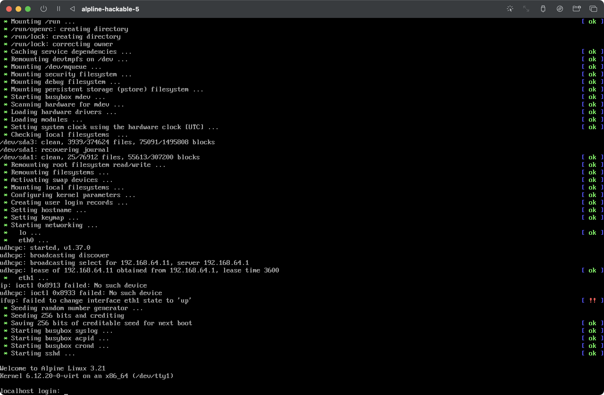
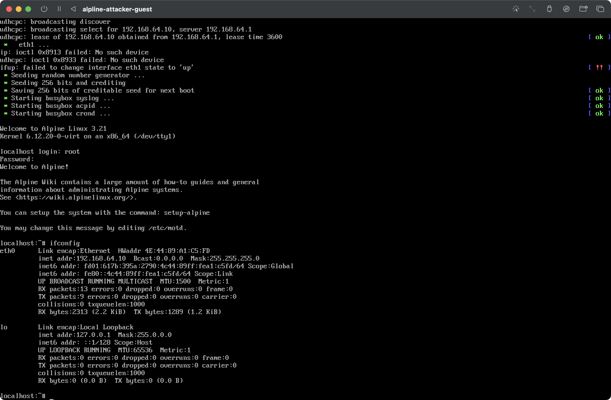
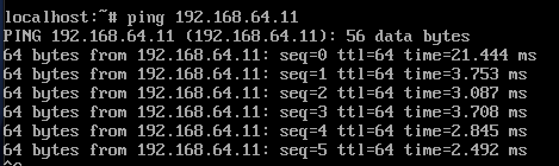
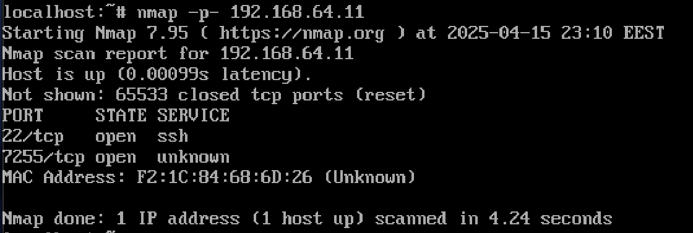
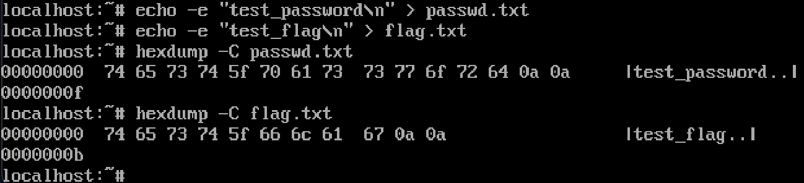
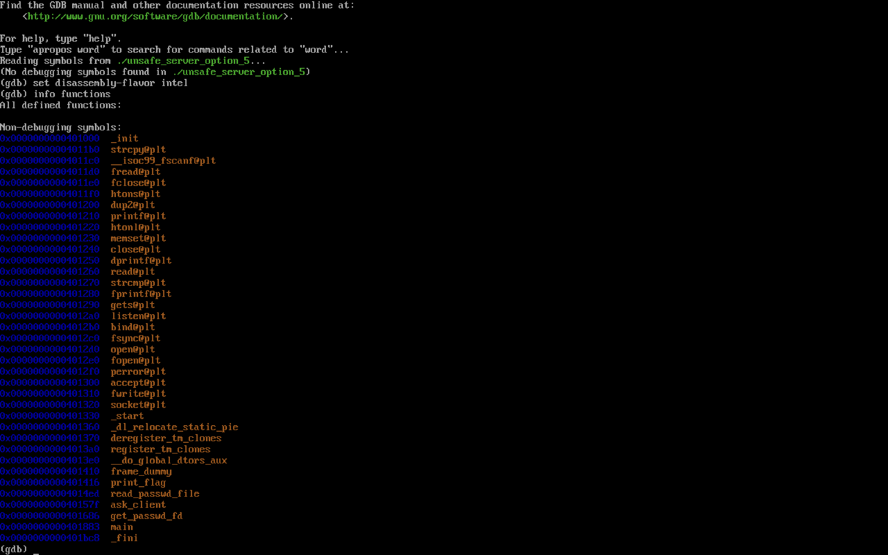
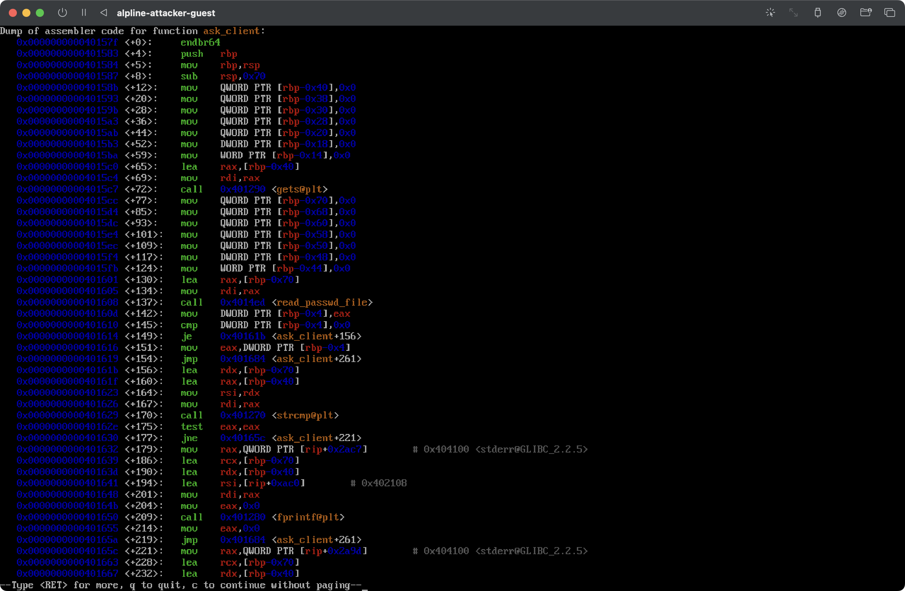
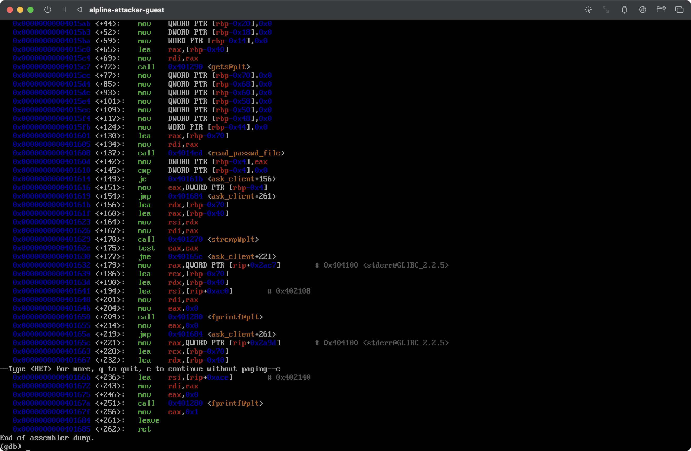
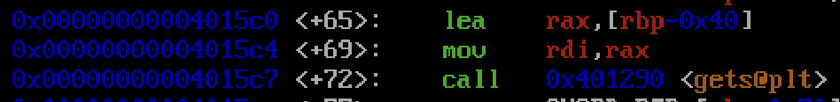
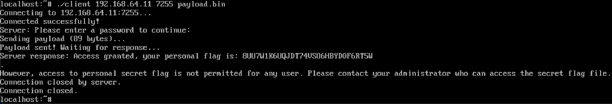

## Lab3: Binary exploitation

The goal of this lab is to get some hands-on experience with hacking a simple socket server using the stack overflow exploit.

## Setup (two Alpine Linux VMs, both connected to the same network):
- alpine-attacker-guest 
- alpine-hackable-5

Locate `.ova` files and extract them
```
tar -xvf alpline-attacker-guest.ova
tar -xvf alpline-hackable-5.ova
```

Convert to `qcow2` for UTM
```
qemu-img convert -f vmdk -O qcow2 alpline-attacker-guest-disk001.vmdk alpline-attacker-guest.qcow2
qemu-img convert -f vmdk -O qcow2 alpline-hackable-5-disk001.vmdk alpline-hackable-5.qcow2
```

And setup in UTM as in lab 1.


First we verify connectivity
```
ifconfig # to check ip-address
```

alpine-attacker-guest: 192.160.64.10
alpine-hackable-5: 192.160.64.11

alpine-attacker-guest: login -- `root`; pass -- `<empty>`





And test connectivity with ping
```
ping [other-vm-ip-address]
```



Accessing binary file on vm was kinda tricky, so i started http server on my machine
```
python3 -m http.server 8000
```
And downloaded the file on attacker vm
```
wget http://192.168.64.1:8000/unsafe_server_option_5
chmod +x unsafe_server_option_5
```

Port scanning 



There are two open ports on the target machine:
- port 22/tcp: as mentioned in the task, this is likely used for setup and administration purposes and can be safely ignored for your exploitation task
- port 7255/tcp: almost certainly our vulnerable server target -- the one running the `unsafe_server_option_5` binary.

Create two files, `flag.txt` and `passwd.txt` in the same directory as the server, and fill them with `test_password\n` and `test_flag\n`, also on the screenshot bellow the hex version is attaached 



Now we start gdb with the server binary
```
gdb --args ./unsafe_server_option_5 passwd.txt
(gdb) set disassembly-flavor intel
(gdb) info functions
```
(it got a little truncated on the screenshot :)) 



Lets disassemble the `ask_client` function first, as that's likely where the vulnerability will be:
```
(gdb) disas ask_client
```




The first thing we notice is 

, this allocates 0x70 (112) bytes on the stack for the function's local variables.


Going downward 

we see the function that uses `gets()` to read user input into a buffer at `[rbp-0x40]`. `gets()` function does not perform any bounds checking, i.e., it will keep reading input until it encounters a newline, potentially overflowing the buffer.

So we have found the vulnerability)) 

Lets dig deeper...

The buffer starts at `[rbp-0x40]` (64 bytes from the base pointer), we need 64 bytes to reach the saved base pointer (rbp), we also need 8 more bytes to overwrite the saved rbp, the next 8 bytes will overwrite the return address -> total offset to return address is 72 bytes.

Now lets craft our exploit strategy. First we need to create a payload that fills the buffer with 72 bytes of padding, then append the return address and the address of the `print_flag` function (0x0000000000401416, 0x401416), after this when the function returns it will jump to `print_flag` instead of its original caller. 

Next we generate payload using `gen_payload.py`.
```
python3 gen_payload.py
```

And C client, that is impelemnted in `client.c`, connects to the target server, reads and sends the payload, receives and displays the server's response. The client takes three arguments: ip address of the server, port number and payload file. 

Compile the client 
```
gcc -o client client.c
```

I use the same approach to transfer those files through http server. 

Now on attacker run
```
./client 192.168.64.11 7255 payload.bin
```

And it works!!!


