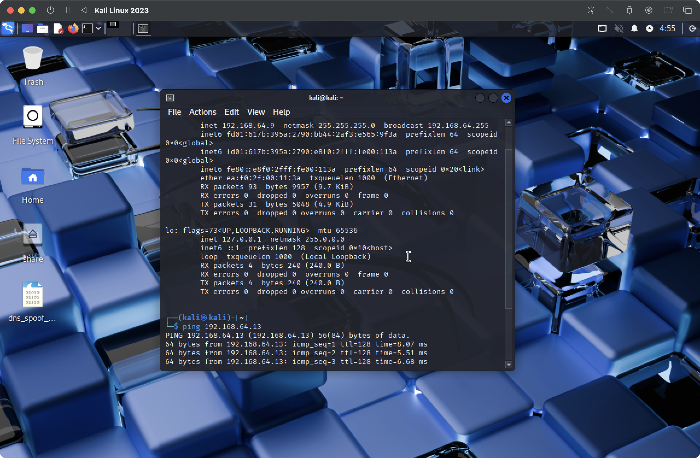
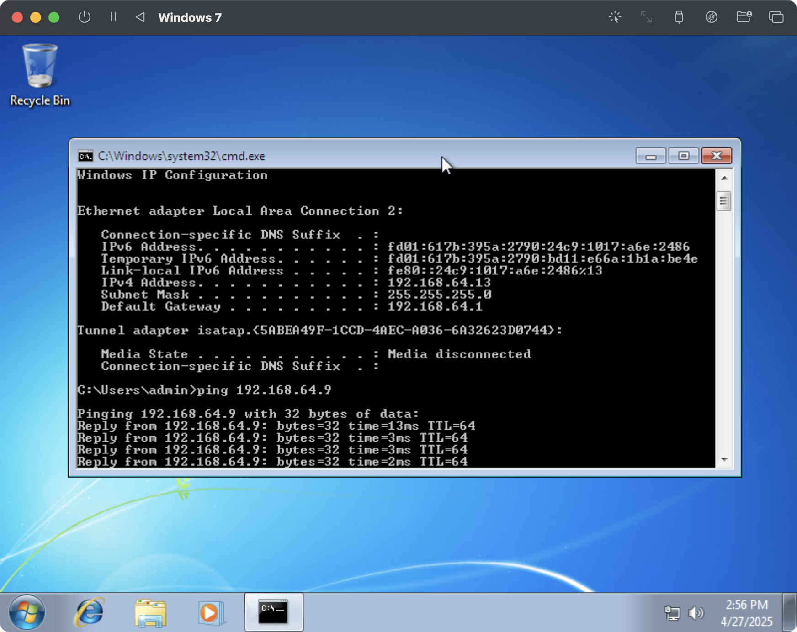
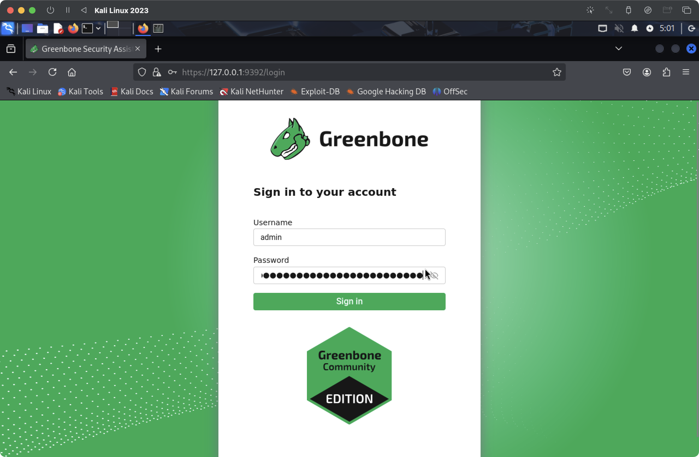
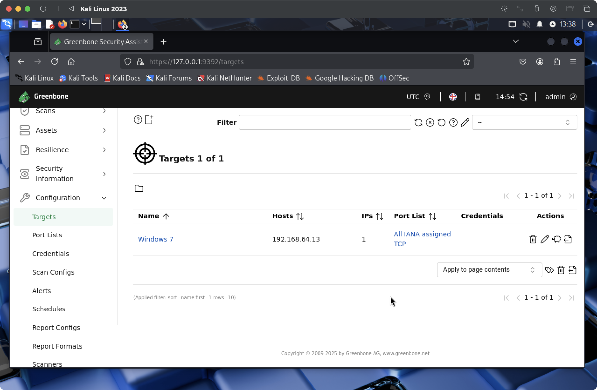
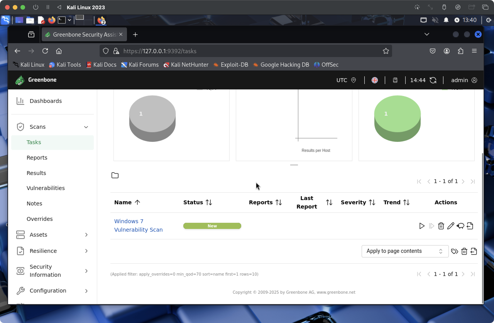
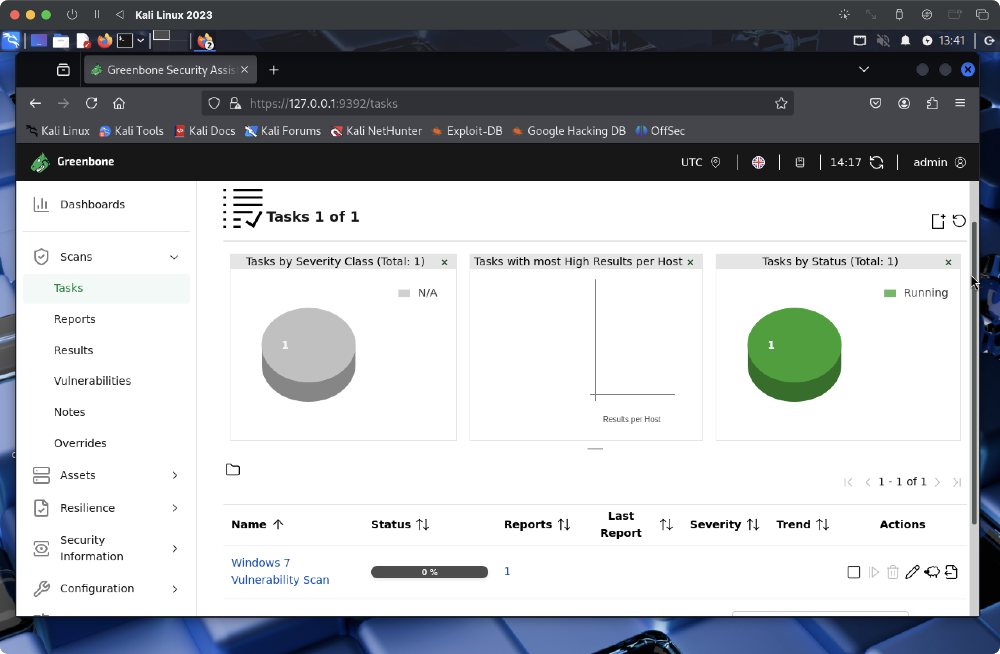
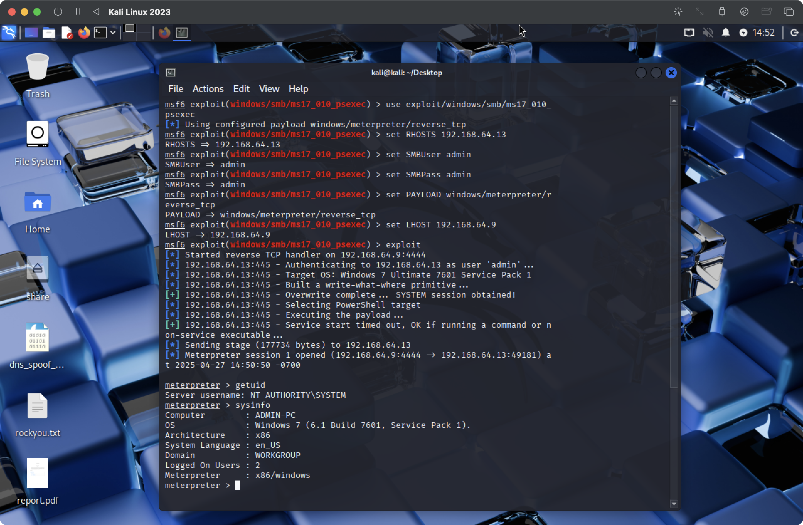

## Lab4: OpenVAS, CVE database

Setup (two virtual machines, both connected to the same network):
- Kali Linux (attacker)
- Windows 7 (victim): [get](https://mac.getutm.app/gallery/windows-7) and [load iso](https://dl.malwarewatch.org/windows/)

Setup in UTM as in lab 1.

Check connectivity as in the previous labs:

```
ifconfig # to check ip-address
```
- Kali Linux ip -- 192.168.64.9
- Windows 7 ip -- 192.168.64.13

And ping on booth machines.

```
ping [other-vm-ip-address] # to test connectivity
```





Next we install all the required tools for Kali:
```
sudo apt update && sudo apt upgrade -y
sudo apt install gvm -y
```

here i had to migrate to PostgreSQL 17
```
sudo systemctl stop postgresql@15-main
sudo systemctl start postgresql@17-main
pg_lsclusters
```
and chenge port to 5432 in 
```
sudo nano /etc/postgresql/17/main/postgresql.conf
```
```
sudo gvm-setup
sudo gvm-start
sudo runuser -u _gvm -- gvmd --create-user=admin --password=admin
```

Next go to `https://127.0.0.1:9392` and log in with credentials given on the terminal. 



Make sure all the feeds in `Feed status` are updated, this might take some time.

When done, we are to create a target, that is our Windows machine. To do so we go to Configuration -> Targets and add it.


Next we need to create a Scan task. To do so we go to Scans -> Tasks and add it, as stated it the task description we need to choose "Full and Fast", this is default, and choose target that we created previously.


And finally we can start the scan, this takes sooome time. 


Upon completion we can go to Scans -> Reports where scan report is located, it cantains summary of all vulnerabilities found, and export it in pdf format. The report is added here as `report.pdf`.

Next having the report, we can identify high-severity vulnerabilities. We need to choose one, so vulnerability of my choice is -- NVT: Microsoft Windows SMB Server Multiple Vulnerabilities-Remote (4013389) as it is high-severity vulnerability with a CVSS score of 8.8. 

Based on the report we can state that this vulnerability affects Windows SMB protocol implementation. When SMBv1 server processes certain transaction requests, it improperly handles memory allocations, creating a buffer overflow condition. Attackers can exploit this to execute arbitrary code with SYSTEM privileges.

My first appempt failed due to architecture mismatch, I used EternalBlue exploit module, but it only supports 64-bit targets, while my Windows 7 VM was a 32-bit system.

After this, I searched for alternative MS17-010 exploit modules and decided to use psexec module instead. 



And this one worked, we got a shell on the Windows 7 machine!
